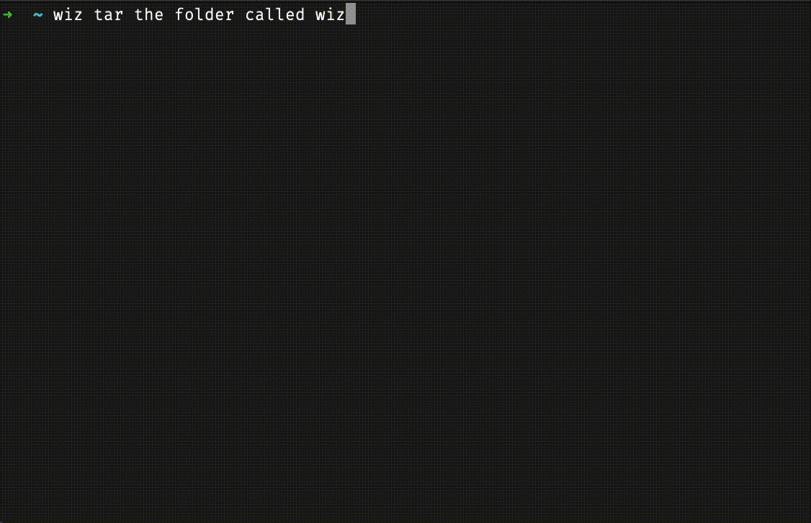

<div align="center">

<h1>🧙‍♂️ Wiz</h1>
</div>

Wiz is an open-source command-line interface (CLI) tool that interprets natural language 🗣️ to generate and explain terminal commands 💻. It operates entirely locally and is compatible macOS 🍏.

<div align="center">
<br />
  
</div>

## 🌟 Features 🌟

- **Command Generation 💬:** Wiz interprets natural language descriptions to generate the corresponding terminal commands.
- **Command Explanation 📖:** Alongside command generation, Wiz also provides a detailed explanation of what each command does.
- **Open Source 💻:** Wiz is completely open-source, allowing for community enhancements and adaptations.
- **Runs Locally 🏠:** Your data never leaves your machine. Wiz runs completely locally, ensuring the privacy and security of your data.

## 📦 Installation 📦

Wiz can be easily installed via npm:

```bash
npm install -g wiz-cli
```

You can update to the latest version at any time using the same command.

**Note 📝:** Wiz requires Node.js to run. If you don't have Node.js installed, you can download it from the [official Node.js website](https://nodejs.org).

## 🛠️ Usage 🛠️

To use Wiz, simply provide a natural language description to the command, and it will generate and explain the corresponding terminal command.

```bash
wiz 'create a new directory named "test"'
```

## 🙏 Contribute 🙏

We welcome contributions! If you'd like to contribute, feel free to fork the repository and submit a pull request.

## 🛣️ Roadmap 🛣️

- [ ] Cross-Platform Compatibility: Expand support for Windows and Linux, as Wiz currently only runs on macOS.
- [ ] Improved Suggestions: Enhance the suggestion model to provide more accurate and diverse command possibilities.
- [ ] Inactivity Server Shutdown: Implement a feature to stop the inference server after a period of inactivity to conserve system resources.
- [ ] Support for Command History: Implement a feature where Wiz can recall and explain previous commands.
- [ ] Machine-learning powered command correction: Implement a feature where Wiz can correct commands executed by the user.
- [ ] Command Completion: Implement a feature where Wiz can complete partial commands entered by the user.

## 📜 License 📜

Wiz is [MIT licensed](./LICENSE).

## 📞 Support 📞

If you have any issues or questions, please don't hesitate to file an issue.

---

Please keep in mind that this project is in early stages and may have some bugs 🐞. Any bug reports or feature requests are welcome. 🙏
